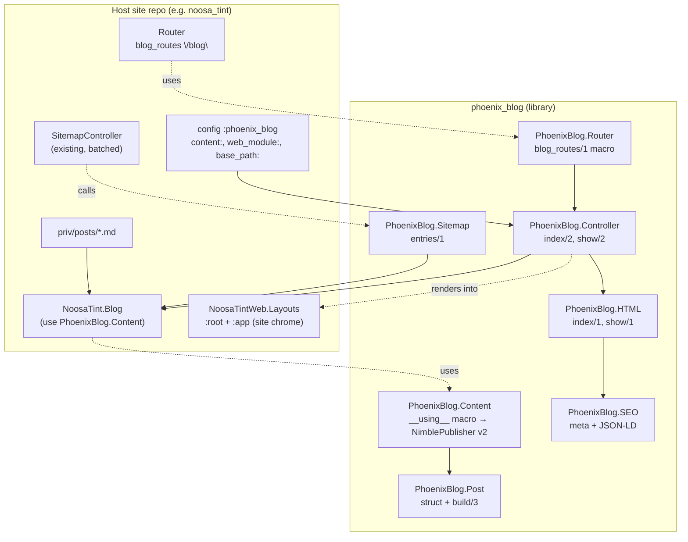
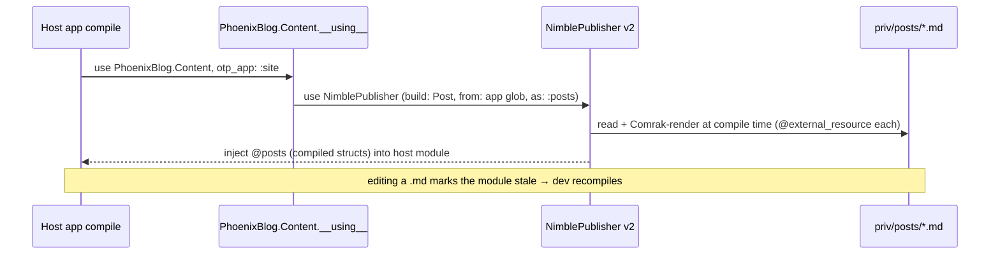

# feat: phoenix_blog — reusable NimblePublisher blog library

## Summary

Build `phoenix_blog`, a small Phoenix library that drops a markdown-backed blog into the family's **Phoenix** sites with a few lines of config per repo. The engine (content compilation, query API, controller, default templates, SEO, sitemap helper) lives in the library; each site keeps only its own `priv/posts/*.md` and a one-module `use PhoenixBlog.Content`. Posts are compiled to structs at build time by NimblePublisher v2 — no database, no runtime file IO. The library renders blog content inside each site's own layout, so each Phoenix site gets a native-looking blog from one engine. Proven end-to-end in one real site (`noosa_tint`) behind a local `path:` dependency before anything is pushed to GitHub.

In-scope Phoenix sites: **noosa_tint** (proof), **reveille**, **ripasso**, **leva_web**. The non-Phoenix sites in Chris's family (sondelle, qbcc-calculator — Next.js; freehold — static; tendrank — TBD) **cannot** use this library and are explicitly out of scope here; a sibling Next.js/MDX blog sharing the same frontmatter schema and `/blog` URL shape is the path for those, planned separately.

**Path convention in this plan:** bare paths (`lib/phoenix_blog/...`) are in the new `phoenix_blog` repo. Paths prefixed `<site>:` (e.g. `noosa_tint:lib/...`) are in that site's own repo.

---

## Problem Frame

Chris runs a family of marketing/product sites that each need a blog for SEO. Several are Phoenix 1.8.5 apps (LiveView 1.1, Bandit, Tailwind, Ecto): three are forks of `programatic_seo_site_template` (`noosa_tint`, `reveille`, `ripasso`) and one is an umbrella app (`leva_web` in `projects/leva`). They are **separate Git repos**, not one umbrella across the family — so a shared in-repo `lib/` app is not an option, and copy-pasting the blog into each repo means N places to fix every bug.

The work is to make the blog a **single source of truth** installable across separate Phoenix repos, while letting each site keep its own look and its own posts, and without standing up a database table or a separate service for what is fundamentally version-controlled content. (The family also includes Next.js and static sites; those cannot consume a Phoenix library and are out of scope here — see Scope Boundaries.)

---

## Requirements

- **R1** — A site adds the blog by: one dependency line, one `use PhoenixBlog.Content` module, one `blog_routes` line in its router, a `priv/posts/` directory, and a sitemap + nav hookup. No per-site templates required for the default look.
- **R2** — Posts are markdown files with frontmatter, committed to each site's repo. Publishing = git push + deploy. No DB, no admin UI.
- **R3** — Blog pages render inside the host site's existing layout (chrome, fonts, colours inherited), so each site's blog looks native to that site.
- **R4** — Each post page emits correct SEO: unique title, meta description, canonical URL, Open Graph + Twitter tags, and JSON-LD `Article` structured data.
- **R5** — Published blog post URLs appear in the site's existing `sitemap.xml` without replacing the current batched sitemap mechanism.
- **R6** — Drafts (`draft: true`) and future-dated posts are excluded from listings, routes, and the sitemap.
- **R7** — The library is router-agnostic and content-module-agnostic: it must not hardcode any one site's module names, routes, or paths.
- **R8** — Installed across repos as a Git dependency (`{:phoenix_blog, github: "chrisohalloran/phoenix_blog"}`); upgrades are a ref bump.

**Success criteria:** the proof site serves `/blog` and `/blog/:slug` inside its own layout with valid SEO and a sitemap entry; editing a `.md` in dev recompiles; the same library installs unchanged into a second repo.

---

## Key Technical Decisions

- **KTD1 — A shared library, not a per-repo copy or a separate service.** At five separate repos, duplication is the cost a library removes; a blog is content+rendering, so a standalone deployed service would add ops and a network hop for no benefit. Rejected both.
- **KTD2 — NimblePublisher v2 (Comrak markdown), markdown-in-git.** Posts compile to structs at build time → zero DB, zero runtime IO, fastest pages, cleanest SEO. v2 uses `:comrak_options` (not Earmark's `:earmark_options`); `makeup_*` highlighters optional. Chosen over DB-backed authoring because authors are Chris/agents writing files, and a file-based engine is far simpler to package across repos (no shared schema or migrations to version).
- **KTD3 — Content compiles in the *host* via a `__using__` macro (the reuse keystone).** `use PhoenixBlog.Content, otp_app: :site` expands `use NimblePublisher` *inside the host module*, so the glob resolves against that site's `priv/posts/`. Same pattern as `use Ecto.Repo`. The library ships the machinery; the host owns the content. This is the one piece carrying real technical risk — proven first in U3 with a fixture host module.
- **KTD4 — Theming via a host layout contract, not per-site templates.** The library is configured with the host's `web_module`; its controller sets `put_root_layout({WebModule.Layouts, :root})` and renders content through `{WebModule.Layouts, :app}`. All five sites are template forks that already expose `Layouts` with `:root` + `:app`, so the contract holds with zero per-site template files. A site can still override by passing its own components.
- **KTD5 — Router-agnostic paths (plain strings, not `~p`).** Verified routes are bound to each host's router and endpoint; the library cannot compile `~p` against an unknown host router. Links are built from a configurable mount path (`base_path`, default `/blog`).
- **KTD6 — Sitemap by helper, not replacement.** The template's `SitemapController` serves DB-batched programmatic pages. The library exposes `PhoenixBlog.Sitemap.entries/1` → `[{loc, lastmod}]`; each site adds one `<sitemap>` reference (or appends a urlset) so blog URLs join the existing sitemap index rather than supplanting it.
- **KTD7 — Verification-first rollout: `path:` dep → prove e2e → publish → `github:` dep.** Nothing goes to GitHub until the blog is proven in one real running site. Removes the "looks done on reasoning" risk before five repos depend on it.

---

## High-Level Technical Design

Component boundary — library owns the engine, host owns content + chrome:



Compile-time content flow (why the macro must expand in the host):



---

## Output Structure

```
phoenix_blog/
├── mix.exs
├── README.md
├── ROLLOUT.md
├── .formatter.exs
├── lib/
│   ├── phoenix_blog.ex
│   └── phoenix_blog/
│       ├── post.ex          # struct + build/3
│       ├── content.ex       # __using__ macro (NimblePublisher wrapper + query API)
│       ├── controller.ex    # index/2, show/2
│       ├── html.ex          # default index/show function components
│       ├── seo.ex           # meta tags + JSON-LD Article
│       ├── sitemap.ex       # entries/1 helper
│       └── router.ex         # blog_routes/1 macro
└── test/
    ├── support/             # fixture host module + test endpoint/router
    ├── fixtures/posts/      # sample .md (published, draft, future-dated)
    └── phoenix_blog/        # one test file per module
```

The tree is the expected shape; per-unit **Files** lists are authoritative.

---

## Implementation Units

### U1. Scaffold the `phoenix_blog` library

**Goal:** A compiling mix library with the right dependencies and no application runtime.
**Requirements:** R8.
**Dependencies:** none.
**Files:** `mix.exs`, `lib/phoenix_blog.ex`, `.formatter.exs`, `README.md`.
**Approach:** `mix new phoenix_blog`. Deps: `{:nimble_publisher, "~> 2.0"}`, `{:phoenix, "~> 1.8"}`, `{:phoenix_html, "~> 4.1"}`, `{:phoenix_live_view, "~> 1.1"}`, and `{:makeup_elixir, "~> 1.0"}` only if code highlighting is kept (see Open Questions). No supervision tree — pure library. Mark phoenix deps `optional: true` where appropriate so the host's versions win.
**Patterns to follow:** standard hex library `mix.exs`; keep `application/0` with no `mod:`.
**Test scenarios:** `Test expectation: none — scaffolding/config only.`
**Verification:** `mix deps.get && mix compile` is clean; `mix format --check-formatted` passes.

### U2. `PhoenixBlog.Post` struct + `build/3`

**Goal:** The compiled post entity NimblePublisher constructs from each file.
**Requirements:** R2, R6.
**Dependencies:** U1.
**Files:** `lib/phoenix_blog/post.ex`, `test/phoenix_blog/post_test.exs`, `test/fixtures/posts/2026-01-02-hello-world.md`, `.../2030-01-01-future.md`, `.../2026-01-03-draft.md`.
**Approach:** struct fields `id` (slug), `title`, `description`, `date`, `tags`, `author`, `body` (rendered HTML), `draft?`, `cover_image`. `@enforce_keys [:id, :title, :date, :body]`. `build(filename, attrs, body)` parses `YYYY-MM-DD-slug` from the filename → `date` + `id`, merges frontmatter `attrs`, normalises `tags` to a list, defaults `author` and `draft?: false`.
**Patterns to follow:** the `Post.build/3` example in NimblePublisher v2 docs (filename → date/slug extraction).
**Test scenarios:**
- Happy path: `build/3` on `2026-01-02-hello-world.md` yields `id: "hello-world"`, `date: ~D[2026-01-02]`, merged title/description, `tags` as a list.
- Defaults: missing `author` → default; missing `draft` → `false`.
- Edge: `tags` given as a single string normalises to a one-element list; empty body still builds.
- Error: a file missing a required frontmatter key raises a clear error at build (compile) time.

### U3. `PhoenixBlog.Content` — the `__using__` macro (reuse keystone)

**Goal:** `use PhoenixBlog.Content, otp_app: :site` gives the host a compiled, queryable blog.
**Requirements:** R2, R6, R7.
**Dependencies:** U2.
**Files:** `lib/phoenix_blog/content.ex`, `test/phoenix_blog/content_test.exs`, `test/support/fixture_blog.ex` (a host module that `use`s the macro against `test/fixtures/posts`).
**Approach:** `__using__` expands, in the caller, `use NimblePublisher, build: PhoenixBlog.Post, from: <glob>, as: :posts, comrak_options: [...]` (plus `highlighters:` if kept). Glob resolves via `Application.app_dir(otp_app, "priv/posts/**/*.md")`, overridable with a `:from` option (tests pass an explicit fixtures glob). After NimblePublisher injects `@posts`, inject query functions: `all_posts/0` (sorted `date` desc), `published/0` (reject `draft?` and `date > today`), `get_by_slug!/1` (raise `PhoenixBlog.NotFound` when absent), `recent/1`, `all_tags/0` (unique, sorted), `by_tag/1`.
**Execution note:** Prove the macro-wrapping works *first* — write `test/support/fixture_blog.ex` and assert its compiled `@posts` before building the rest of the query API. This is KTD3's risk, retired here.
**Patterns to follow:** `use Ecto.Repo`-style host-expanded macro; NimblePublisher "wrap in your own Blog module" guidance.
**Test scenarios:**
- Keystone: the fixture host module compiles and `all_posts/0` returns the fixtures sorted newest-first.
- `published/0` excludes the `draft: true` fixture and the future-dated fixture.
- `get_by_slug!/1` returns the matching post; raises `PhoenixBlog.NotFound` for an unknown slug.
- `by_tag/1` filters to posts carrying the tag; `all_tags/0` is de-duplicated and sorted.
- `recent(2)` returns the two newest published posts.
- Covers R6.

### U4. `PhoenixBlog.HTML` — default index + show components

**Goal:** Native-looking default index and article templates as function components.
**Requirements:** R3.
**Dependencies:** U2.
**Files:** `lib/phoenix_blog/html.ex`, `test/phoenix_blog/html_test.exs`.
**Approach:** `use Phoenix.Component`. `index/1` (assigns: `posts`, `tags`, `base_path`) renders a card per post (title, formatted date, description, tag chips) linking to `base_path <> "/" <> slug`. `show/1` (assigns: `post`, `base_path`) renders title, date, tags, author, and `{raw(@post.body)}` inside a `prose`-styled container. No `<html>/<head>` — the host root layout owns those. Tailwind utility classes that inherit each site's design tokens; links are plain strings (KTD5).
**Patterns to follow:** template's `PageComponents` / `CoreComponents` class conventions for visual consistency.
**Test scenarios:**
- Index renders one card per supplied post with title, ISO/long date, description, and a correct `base_path` link.
- Show renders the post title, formatted date, tag chips, author, and raw body HTML.
- Empty state: `index/1` with `posts: []` renders a friendly empty message, not a crash.
- Edge: a post with no tags renders without an empty tag row.

### U5. `PhoenixBlog.SEO` — meta tags + JSON-LD Article

**Goal:** Per-post SEO head content.
**Requirements:** R4.
**Dependencies:** U2.
**Files:** `lib/phoenix_blog/seo.ex`, `test/phoenix_blog/seo_test.exs`.
**Approach:** `post_meta/1` returns `<title>`, `<meta name="description">`, `<link rel="canonical">`, OG (`og:title/description/type=article/url`), Twitter card tags, and a `<script type="application/ld+json">` `Article` (headline, description, datePublished, author, optional image). Canonical base from config `:canonical_base`, falling back to the conn host. `index_meta/1` for the listing page. Values HTML/JSON-escaped.
**Patterns to follow:** the template's `PseoStarter.SEO.canonical_url/1` for canonical shape; reuse via config rather than import.
**Test scenarios:**
- `post_meta/1` emits title, description, canonical, OG, and Twitter tags for a post.
- JSON-LD includes `headline`, `datePublished` (ISO 8601), `author`, `description`, and is valid JSON.
- Escaping: a title containing `"` / `<` is safely escaped in both meta and JSON-LD.
- `index_meta/1` uses the configured blog title/description.

### U6. `PhoenixBlog.Controller` + `PhoenixBlog.Router` mount macro

**Goal:** Servable routes that read the host content module and render in the host layout.
**Requirements:** R1, R3, R7.
**Dependencies:** U3, U4, U5.
**Files:** `lib/phoenix_blog/controller.ex`, `lib/phoenix_blog/router.ex`, `test/phoenix_blog/controller_test.exs`, `test/support/{test_endpoint.ex,test_router.ex}`.
**Approach:** Controller resolves `content` module, `web_module`, `base_path`, and SEO config from `Application.get_env(:phoenix_blog, ...)` (or router-macro opts). `index/2` assigns `published/0` + `all_tags/0`; `show/2` calls `get_by_slug!/1`, rescuing `PhoenixBlog.NotFound` → 404. Both set `put_root_layout({web_module}.Layouts, :root)` and render `PhoenixBlog.HTML` content wrapped by `{web_module}.Layouts, :app` (KTD4). `blog_routes(path \\ "/blog", opts \\ [])` macro injects `get path, PhoenixBlog.Controller, :index` and `get path <> "/:slug", PhoenixBlog.Controller, :show`; its docstring states it MUST be placed above any `/*path` catch-all.
**Patterns to follow:** template `web.ex` `:controller` quote (Phoenix.Controller + verified_routes); a minimal test endpoint mirroring `PseoStarterWeb.Endpoint`.
**Test scenarios:**
- `GET /blog` → 200, body lists published posts (drafts/future absent).
- `GET /blog/:slug` (known) → 200, renders article + SEO meta in the page head.
- `GET /blog/:slug` (unknown) → 404 via `PhoenixBlog.NotFound`.
- Custom mount: `blog_routes "/insights"` serves at `/insights` and links use that base.
- Integration: the rendered response is wrapped by the configured host layout (assert a layout-only marker is present), proving chrome delegation across the controller→layout boundary.
- Covers R3, R7.

### U7. `PhoenixBlog.Sitemap` integration helper

**Goal:** Feed published post URLs into the host's existing sitemap.
**Requirements:** R5, R6.
**Dependencies:** U3.
**Files:** `lib/phoenix_blog/sitemap.ex`, `test/phoenix_blog/sitemap_test.exs`.
**Approach:** `entries/1` (opts: content module, base_path, canonical base) returns `[%{loc: url, lastmod: date}]` for `published/0`, with `loc` built from canonical base + `base_path` + slug. Optional `urlset_xml/1` convenience for sites that want a ready blog urlset at e.g. `/sitemaps/blog.xml`. Host integration documented in ROLLOUT.md: add one `<sitemap>` line to the sitemap index referencing the blog urlset.
**Patterns to follow:** template `SitemapController` `wrap/2` + `xml_escape/1` + `SEO.canonical_url/1`.
**Test scenarios:**
- Returns one entry per published post with correct `loc` (canonical + base_path + slug) and `lastmod` (post date).
- Excludes drafts and future-dated posts.
- Custom `base_path` is reflected in every `loc`.
- `urlset_xml/1` produces well-formed, escaped XML.
- Covers R5, R6.

### U8. Proof integration into `noosa_tint`, verify e2e, then publish + rollout doc

**Goal:** Prove the whole thing in one real site behind a `path:` dep, then publish and document rollout.
**Requirements:** R1–R8 (end-to-end).
**Dependencies:** U6, U7.
**Files:** `noosa_tint:mix.exs` (path dep → later github), `noosa_tint:lib/noosa_tint/blog.ex`, `noosa_tint:lib/noosa_tint_web/router.ex`, `noosa_tint:priv/posts/2026-06-19-<first-post>.md`, `noosa_tint:lib/noosa_tint_web/components/layouts/root.html.heex` (nav link), `noosa_tint:lib/noosa_tint_web/controllers/sitemap_controller.ex` (blog entry), `noosa_tint:config/config.exs`; `phoenix_blog:README.md`, `phoenix_blog:ROLLOUT.md`.
**Approach:** Add `{:phoenix_blog, path: "../../phoenix_blog"}`; create `NoosaTint.Blog` via `use PhoenixBlog.Content, otp_app: :noosa_tint`; configure `content/web_module/base_path/canonical_base`; mount `blog_routes "/blog"` ABOVE the `/*path` catch-all; write one real post; add a nav link and the sitemap entry. Run the server and verify in the browser. Only once green: create the GitHub repo, push, switch `noosa_tint` to `{:phoenix_blog, github: "chrisohalloran/phoenix_blog"}`, and write ROLLOUT.md (the 5-step per-site recipe) for the remaining sites.
**Execution note:** This is the verification gate (KTD7). Do not publish to GitHub or roll out until the e2e checks below pass in a running `noosa_tint`.
**Test scenarios / verification (outcomes):**
- `/blog` and `/blog/:slug` render in noosa_tint's own layout (site nav/fonts/colours present).
- View-source shows the post's `<title>`, meta description, canonical, OG/Twitter, and a valid JSON-LD `Article`.
- `/sitemap.xml` (or `/sitemaps/blog.xml`) includes the post URL; the draft/future fixtures do not appear.
- Editing the post `.md` in `dev` triggers recompile and the change shows on refresh.
- The catch-all `PageController` still serves unknown paths (blog routes didn't break existing routing).
- After publishing: `mix deps.get` resolves the `github:` dep and the site compiles unchanged.

---

## Scope Boundaries

**In scope:** the library (U1–U7) and a proven single-site integration + rollout doc (U8).

### Deferred to Follow-Up Work
- Rolling the `github:` dep into the remaining Phoenix sites — `reveille`, `ripasso`, `leva_web` — mechanical repetition of U8's recipe once ROLLOUT.md exists. (`leva_web` first needs its layout contract checked — see Risks.)
- Optionally adding the library to `programatic_seo_site_template` itself so future forks inherit the blog automatically (recommended; not requested this round).
- A **sibling Next.js/MDX blog** for the non-Phoenix sites (sondelle, qbcc-calculator) and a static-markdown approach for `freehold`, sharing this library's frontmatter schema and `/blog` URL shape. Separate plan.
- RSS/Atom feed generation.
- Tag index pages and pagination beyond a simple list + tag filter.
- Per-site template overrides beyond the default look (the hook exists via KTD4; bespoke templates are per-site work).
- Code-syntax highlighting tuning (makeup themes) if technical posts later need it.

### Non-Goals (outside this library's identity)
- The non-Phoenix family sites (sondelle, qbcc-calculator, freehold, tendrank) — a Phoenix library cannot install into Next.js/static apps. Out of scope by decision, not omission.
- DB-backed authoring / admin CRUD (explicitly rejected — KTD2).
- A standalone blog service or separate deployment (KTD1).
- Comments, search, author profiles, scheduling-by-clock (files + git are the workflow).

---

## Risks & Dependencies

- **Macro-wrapping NimblePublisher (KTD3).** Compile-time glob resolution and `@external_resource` recompile must work when `use NimblePublisher` is nested inside our `__using__`. *Mitigation:* U3 proves it with a fixture host module before the rest of the API is built; if nesting misbehaves, fall back to a tiny per-site `blog.ex` that calls `use NimblePublisher` directly with library-provided options.
- **Route ordering.** Blog routes mounted after the template's `/*path` catch-all are silently swallowed. *Mitigation:* `blog_routes` docstring + ROLLOUT.md require placement above the catch-all; U8 verifies both blog and catch-all still resolve.
- **Layout-contract drift (KTD4), esp. `leva_web`.** The theming relies on each host exposing `Layouts` with `:root` + `:app`. The three template forks (noosa_tint, reveille, ripasso) satisfy this; **`leva_web` is an umbrella app, not a template fork, so its layout module may differ** and blog chrome could break there. *Mitigation:* document the contract; verify `leva_web`'s `Layouts` before rollout (deferred per Scope Boundaries); the controller falls back to its own minimal layout when the configured `:root`/`:app` is absent, so a contract miss degrades gracefully rather than crashing.
- **NimblePublisher v1→v2 differences.** Comrak replaces Earmark; option names changed. *Mitigation:* pinned v2 docs already fetched; verify exact options at U2/U3 against `~> 2.0`.
- **SEO canonical base per site.** Wrong canonical host hurts SEO. *Mitigation:* explicit `:canonical_base` config with a conn-host fallback; U5/U8 assert it.

**External dependency:** `nimble_publisher ~> 2.0` (+ Comrak via MDEx, `makeup_*` if highlighting kept).

---

## Open Questions

All four resolved with Chris 2026-06-19:
- **Target repos** — Phoenix sites only: `noosa_tint`, `reveille`, `ripasso`, `leva_web`. Non-Phoenix family sites are out of scope (Scope Boundaries).
- **Package name** — `phoenix_blog`.
- **Proof site** — `noosa_tint`.
- **Code highlighting** — omitted for now (no `makeup_*`); add later if a technical post needs it.

Remaining to verify during execution (not blocking):
- **`leva_web` layout contract** — confirm it exposes `Layouts` `:root`/`:app` before rollout (Risks).
- **Template inheritance** — whether to also add the library to `programatic_seo_site_template` so future forks inherit it (recommended).

---

## Sources & Research

- NimblePublisher v2.0.0 hexdocs — `use` options (`build`, `from`, `as`, `comrak_options`, `highlighters`, `parser`, `html_converter`), compile-time `@posts` injection, `Post.build/3` example. **Load-bearing** (shaped KTD2/KTD3, U2/U3).
- Direct repo recon of `programatic_seo_site_template` (Phoenix 1.8.5 stack, `web.ex` quotes, `Layouts` `:root`/`:app` contract, batched `SitemapController` + `SEO.canonical_url/1`, public scope `/*path` catch-all at router.ex). **Load-bearing** (shaped KTD4/KTD5/KTD6, U6/U7/U8).
- Confirmed family lineage and separate-repo topology (`noosa_tint`, `ai_site_diary` GitHub remotes) → KTD1/KTD7.
