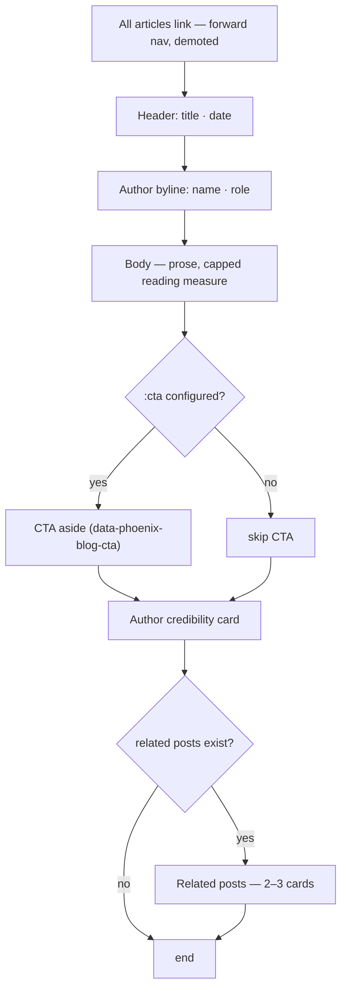

# feat: Blog conversion architecture for phoenix_blog

**Created:** 2026-06-22
**Type:** feat
**Depth:** Deep (phased)
**Target repo:** `phoenix_blog` — except Unit U10, which targets `programatic_seo_site_template` (noted inline). All paths are repo-relative to their stated repo.
**Origin:** WowMoment council audit (3 lenses: direct-response copywriter, UX/UI designer, PLG PM), unanimous verdict + this session's call-out resolutions.

---

## Summary

`phoenix_blog` renders and ranks beautifully but converts nobody. The post page closes
`</article>` immediately after the body — no call-to-action, no author credibility, no
related reading — so every host site that inherits the library gets a blog that is
top-of-funnel traffic with no path to the host's revenue action. This plan adds the
missing conversion architecture **in the library, host-agnostic**: the engine ships the
slots with sensible defaults and each site supplies the content via config and frontmatter.
It also lands the quick-win readability, navigation, and structured-data fixes, plus a
per-post `noindex` primitive that resolves the starter-post SEO footgun without removing the
developer's live `/blog` proof.

The work is backward-compatible by construction: every new assign, config key, and
frontmatter field is optional, and existing forks render unchanged until they opt in. It
reaches all installed sites (noosa_tint, ripasso, leva_web) and every future template fork
only when each deliberately bumps the git dependency.

---

## Problem Frame

The blog's job is to be the host business's **top-of-funnel acquisition surface**: convert an
organic / AI-search visitor who lands on a long-tail post into the host's core action
(quote, demo, contact, buy). Today the conversion stage is structurally absent — the
post → core-action click-through rate is pinned at 0% because there is no click target to
render. The audit's three independent lenses put the same finding first: **the post page
ends in a void.**

This is a library-level structural gap, not a content gap. Because every fork inherits the
same `show/1` and `index/1` components, the missing slots propagate to every site built on
the template. Fixing the structure once fixes every fork.

A secondary, high-embarrassment defect: the starter post ships `index,follow` and in the
sitemap, so a fork that forgets to delete it serves developer instructions to Google as its
only indexed blog content.

---

## Requirements

Traced to the audit findings and the four call-out resolutions confirmed this session.

- **R1 — End-of-post CTA.** The post page renders a config-driven call-to-action after the
  body, carrying a stable analytics hook, so a configured host routes the highest-intent
  reader into its core action. Renders only when a host supplies `:cta` (no CTA-to-nowhere).
- **R2 — Related posts.** The post page renders 2–3 related posts (same-tag, recency
  fallback) below the CTA — a retention path and an internal-linking SEO lever.
- **R3 — Author credibility.** The bare `@post.author` string is promoted to a credibility
  block (name + optional role + optional link), front-loaded in the header and/or end card.
- **R4 — Index as positioning surface.** The index supports an optional heading and intro,
  and its empty state offers the host's action instead of "check back soon".
- **R5 — Body readability.** The post body drops `max-w-none` so it keeps a readable measure.
- **R6 — Forward navigation + tag labelling.** The back-link reads as forward motion; the
  index tag strip is labelled or linked; the literal `#{tag}` render is corrected.
- **R7 — Structured-data completeness.** Article JSON-LD gains `publisher`, `dateModified`,
  `mainEntityOfPage`, and a `BreadcrumbList`; the index emits a `Blog`/`CollectionPage` node.
- **R8 — Per-post `noindex` + sitemap exclusion.** A post may set `noindex: true`; such posts
  still render in-app but are excluded from the sitemap and set `robots: noindex,follow`. The
  starter post ships `noindex: true`.
- **R9 — Tag facet pages.** `/blog/tag/:tag` lists posts carrying a tag, with its own SEO and
  collection schema; index/post tag chips link to it.
- **R10 — Host-agnostic, backward-compatible, versioned.** All additions are optional and
  default to current behaviour where a host opts out; the change ships as a tagged release
  and reaches sites only on a deliberate dependency bump.

---

## Key Technical Decisions

- **KTD1 — Slots in the library, content per-host.** Conversion structure lives in
  `PhoenixBlog.HTML` + `PhoenixBlog.Controller`; the *content* (CTA copy/href, author role,
  publisher org) is supplied per-site via `blog_routes` opts / `config :phoenix_blog` and
  per-post frontmatter. This is the existing config pattern (`controller.ex` `config/3`),
  extended, not replaced. (Simplicity Protocol: extend `show/1`, do not rebuild.)
- **KTD2 — CTA renders iff configured; template ships the default.** The library renders the
  CTA only when `:cta` is present, so a fresh fork never shows a "Get in touch → /" stub that
  reads as broken. The flagship fork converts by default because the *template*
  (`programatic_seo_site_template`, U10) ships a sensible `:cta`. Honesty in the library,
  conversion in the default fork.
- **KTD3 — Analytics is a hook, not a dependency.** The CTA carries a stable
  `data-phoenix-blog-cta` attribute (and the target href) so a host's existing analytics
  (GA/Plausible/etc.) can measure post → core-action CTR. The library bundles no tracker.
- **KTD4 — `noindex` is a per-post primitive that preserves the dev proof.** A `noindex`
  frontmatter flag keeps the post visible at `/blog` (so the starter post remains the
  developer's live, zero-config proof) while excluding it from the sitemap and flipping
  `robots` to `noindex,follow`. This resolves the starter-post footgun without drafting the
  proof away, and is a generally useful primitive (internal/utility pages).
- **KTD5 — Related posts and facet pages reuse existing query primitives.** `content.ex`
  already injects `by_tag/1` and `recent/1`; related posts = `by_tag` of the first tag minus
  the current post, recency fallback via `recent/1`. No new compiled-content API.
- **KTD6 — Tag facet route is additive and conflict-free.** `/blog/tag/:tag` is a two-segment
  path; `/blog/:slug` is one segment, so Phoenix's segment-count matching keeps them
  disjoint regardless of order. The only shadow is a post whose slug is literally `tag` —
  documented, not handled.
- **KTD7 — Publisher schema from host config.** `publisher` (Organization, name + logo) and
  the canonical site name come from `:publisher`/`:site_name` config, defaulting to omission
  when unset (schema stays valid, just thinner). `dateModified` derives from an optional
  `updated` frontmatter date, falling back to `date`.
- **KTD8 — Backward compatibility is the gate.** Existing forks must keep rendering with no
  config changes. The one intentional visual change to current sites is R5 (body width) and
  R6 (tag chip / back-link copy); both are improvements, both are called out in the changelog
  so a site sees them on its next deliberate bump.

---

## High-Level Technical Design

### Post-page render order (the new anatomy)

The void is closed by appending three slots after the body. Order matters: the reader hits
the CTA at peak intent, then credibility, then lateral retention.

### Where each slot's content comes from

| Slot | Library renders | Content source | Default when unset |
|---|---|---|---|
| CTA | `HTML.show/1` aside | `:cta` config (`%{heading, sub, label, href}`) | not rendered (KTD2) |
| Author block | `HTML.show/1` header + card | `author`, `author_role`, `author_url` frontmatter | name only (current behaviour) |
| Related posts | `HTML.show/1` footer | `by_tag/1` + `recent/1` (KTD5) | not rendered if none |
| Index heading/intro | `HTML.index/1` | `:heading` / `:intro` config | "Blog" heading, no intro |
| Publisher schema | `SEO.article_schema` | `:publisher` / `:site_name` config | field omitted (KTD7) |
| `noindex` | `SEO.post_meta` + `Sitemap.entries` | `noindex` frontmatter | `false` (indexed) |
| Tag facet | new `Controller.tag/2` | `by_tag/1` | empty list renders empty-state |

The data path is uniform: **frontmatter/config → controller assigns → component slot**,
matching the existing `assign_seo` / `config/3` flow in `controller.ex`.

---

## Scope Boundaries

**In scope:** the library changes for R1–R9, the per-post `noindex` primitive, and the U10
rollout into the template (default `:cta`, real starter post, docs, tagged release).

### Deferred to Follow-Up Work
- Writing real per-host CTA/author/publisher copy for noosa_tint, ripasso, and leva_web (each
  is a per-site content edit on top of this library release; the library + template land here,
  the host copy is a separate small PR per site).
- A bundled analytics integration (KTD3 ships the hook; wiring a specific provider is host work).
- Inline mid-body CTA anchors (the PM's optional extra) — the end-of-post CTA is the
  load-bearing one; revisit only if CTR data warrants.
- Lead-capture / email slot — only relevant to hosts with a slow sell; out until a host needs it.

### Out of scope
- Any visual redesign of the post/index beyond the new slots and the readability fix.
- Replacing the host-layout chrome model (nav/footer stay the host's responsibility).
- A migration of reveille's bespoke designed posts (separate decision, unrelated to this work).

---

## Implementation Units

Phased. Within a phase, units are independent unless a dependency is named. Build order is
the unit order. Execution posture: **test-first for feature-bearing units** — the suite is
strong (36 tests) and these are behavioural additions, so write the failing assertion first.

### Phase A — Foundation & quick wins

### U1. Extend the post struct + frontmatter

**Goal:** Add the fields later units read: `author_role`, `author_url`, `noindex`, `updated`.
**Requirements:** R3, R7, R8.
**Dependencies:** none.
**Files:** `lib/phoenix_blog/post.ex`; `test/phoenix_blog/post_test.exs`.
**Approach:** Add the four fields to `defstruct`, `@type`, and the `build/3` mapping
(`Map.get(attrs, :author_role)`, etc.; `noindex` coerced like `draft?` to a strict boolean;
`updated` parsed to a `Date` when present, else `nil`). Document the new frontmatter keys in
the moduledoc. No required-key changes — all optional.
**Patterns to follow:** the existing `draft?: Map.get(attrs, :draft, false) == true` coercion
and `cover_image` optional mapping in `build/3`.
**Test scenarios:**
- Happy: frontmatter with `author_role`/`author_url` populates the struct fields.
- Edge: absent new keys → `author_role`/`author_url`/`updated` are `nil`, `noindex` is `false`.
- Edge: `noindex: true` → `true`; `noindex: "yes"` or absent → `false` (strict coercion).
- Edge: `updated: "2026-06-20"` parses to a `Date`; malformed `updated` raises a clear error.
**Acceptance:** new optional fields exist and default safely; existing posts build unchanged.
**Verification:** `post_test.exs` passes; no other module references break (additive struct).

### U2. Quick-win polish: readability, forward nav, tag chips

**Goal:** Remove the body width cap, make navigation forward, fix the tag-chip render.
**Requirements:** R5, R6.
**Dependencies:** none.
**Files:** `lib/phoenix_blog/html.ex`; `test/phoenix_blog/html_test.exs`.
**Approach:** In `show/1`, drop `max-w-none` from the prose container so the reading measure
returns (optionally bump to `prose-lg`); relabel `&larr; Back to blog` to a forward
`All articles` and demote it visually. In `index/1` and `show/1`, fix the literal `#{tag}`
chip (currently renders "#meta") — render the tag text cleanly, and label the index tag strip
(e.g. a "Topics" affordance) or remove it pending U9's linking.
**Patterns to follow:** existing Tailwind token classes already used in the components.
**Test scenarios:**
- Happy: `show/1` output no longer contains `max-w-none`; contains the `All articles` label.
- Happy: a post/index with tags renders the tag text without a stray `#{` artifact.
- Edge: a post with no tags renders no tag strip (unchanged).
- Regression: update any existing test asserting the old "Back to blog" copy.
**Acceptance:** body reads at a sane measure; nav points forward; tag chips render cleanly.
**Verification:** `html_test.exs` passes including updated copy assertions.

### Phase B — Conversion architecture (the big bets)

### U3. End-of-post CTA slot (+ analytics hook)

**Goal:** Render a config-driven CTA after the body — the headline conversion fix.
**Requirements:** R1.
**Dependencies:** none (renders from a new assign).
**Files:** `lib/phoenix_blog/html.ex`, `lib/phoenix_blog/controller.ex`;
`test/phoenix_blog/html_test.exs`, `test/phoenix_blog/controller_test.exs`.
**Approach:** Add a `cta` attr to `show/1` (default `nil`). When present (`%{heading, sub,
label, href}`), render an `<aside>` after the body carrying `data-phoenix-blog-cta` and the
`href`; when `nil`, render nothing (KTD2). In `controller.ex` `show/2`, read `:cta` via the
existing `config/3` and `assign(:cta, ...)`. Keep copy slot-only — no default copy in the
library.
**Patterns to follow:** `config/3` reads in `controller.ex`; `attr` defaults in `html.ex`.
**Test scenarios:**
- Happy: with `:cta` configured, `show` output contains the heading, label, `href`, and the
  `data-phoenix-blog-cta` hook.
- Edge: with no `:cta`, `show` output contains no CTA aside and no `data-phoenix-blog-cta`.
- Edge: `:cta` missing `:sub` → renders without the sub line, no crash.
- Integration: route `private` `:cta` flows through the controller to the rendered aside.
**Acceptance:** a configured host shows a tracked CTA after every post; an unconfigured host
shows none.
**Verification:** `controller_test.exs` + `html_test.exs` pass; CTR hook present in markup.

### U4. Author-credibility block

**Goal:** Promote the bare author string to a credibility block.
**Requirements:** R3.
**Dependencies:** U1.
**Files:** `lib/phoenix_blog/html.ex`; `test/phoenix_blog/html_test.exs`.
**Approach:** In `show/1`, render `author` with optional `author_role` (byline) and, when
`author_url` is set, link the name; add a compact end-of-post author card. Degrade to the
current name-only byline when role/url are absent.
**Patterns to follow:** header markup already in `show/1`.
**Test scenarios:**
- Happy: role + url present → byline shows "name · role" and links to url.
- Edge: only `author` present → renders name only (current behaviour, no empty role/link).
- Edge: `author_url` present, `author_role` absent → linked name, no role text.
**Acceptance:** credibility renders when supplied; bare-author posts look unchanged.
**Verification:** `html_test.exs` covers all three author shapes.

### U5. Related-posts slot

**Goal:** Render 2–3 related posts below the CTA.
**Requirements:** R2.
**Dependencies:** U3 (renders after the CTA in `show/1`).
**Files:** `lib/phoenix_blog/html.ex`, `lib/phoenix_blog/controller.ex`;
`test/phoenix_blog/html_test.exs`, `test/phoenix_blog/controller_test.exs`.
**Approach:** Add a `related` attr (default `[]`) to `show/1`; render a small card list when
non-empty. In `controller.ex` `show/2`, compute related via `content.by_tag(first_tag)` minus
the current post, recency fallback `content.recent/1`, capped at 3, and assign. Helper lives
in the controller (host content module is the data source).
**Patterns to follow:** KTD5; existing `content.published()`/`all_tags()` calls in the controller.
**Test scenarios:**
- Happy: a post sharing a tag with two others → those two render as related cards.
- Edge: a post with no tags or no tag-siblings → recency fallback fills the slot (excluding self).
- Edge: only one post total → related is empty, slot not rendered.
- Edge: related never includes the current post.
**Acceptance:** every post offers a lateral next step when one exists; never links to itself.
**Verification:** `controller_test.exs` proves selection logic; `html_test.exs` proves render.

### U6. Index as positioning surface

**Goal:** Give the index an optional heading/intro and a converting empty state.
**Requirements:** R4.
**Dependencies:** none (CTA reuse from U3 is optional).
**Files:** `lib/phoenix_blog/html.ex`, `lib/phoenix_blog/controller.ex`;
`test/phoenix_blog/html_test.exs`, `test/phoenix_blog/controller_test.exs`.
**Approach:** Add `heading`/`intro` attrs to `index/1` (defaults preserve the "Blog" H1 and no
intro). Replace the "No posts yet. Check back soon." empty state with one that renders the
host CTA when configured, falling back to neutral copy. Controller reads `:heading`/`:intro`
config and passes the same `:cta`.
**Patterns to follow:** `index_meta` already accepts `:title`/`:description`; mirror for on-page.
**Test scenarios:**
- Happy: configured heading/intro render on the index.
- Edge: unset → H1 stays "Blog", no intro (current behaviour).
- Edge: empty index with `:cta` set → CTA renders instead of "check back"; without `:cta` →
  neutral non-dead-end copy.
**Acceptance:** the index reads as a positioning surface; a sparse fork never shows a dead end.
**Verification:** `html_test.exs` + `controller_test.exs` cover populated and empty states.

### Phase C — SEO hardening

### U7. Structured-data completeness

**Goal:** Strengthen Article JSON-LD and add index collection schema.
**Requirements:** R7.
**Dependencies:** U1 (`updated` → `dateModified`).
**Files:** `lib/phoenix_blog/seo.ex`, `lib/phoenix_blog/controller.ex`;
`test/phoenix_blog/seo_test.exs`.
**Approach:** In `article_schema`, add `publisher` (Organization from `:publisher`/`:site_name`
config, omitted when unset), `dateModified` (`post.updated || post.date`), `mainEntityOfPage`
(the canonical url), and a `BreadcrumbList`. In `index_meta`, populate `schema` with a
`Blog`/`CollectionPage` node + `BreadcrumbList`. Thread publisher config through
`SEO.post_meta`/`index_meta` from the controller.
**Patterns to follow:** the `maybe_put/3` omit-when-nil helper already in `seo.ex`.
**Test scenarios:**
- Happy: with publisher config, article schema includes a well-formed `publisher` Organization.
- Edge: without publisher config, schema omits `publisher` and stays valid JSON-LD.
- Happy: `dateModified` equals `updated` when set, else `datePublished`.
- Happy: index emits a non-empty `schema` with a collection node + breadcrumbs.
- Edge: JSON-LD remains `Jason.encode!`-safe (no nil values, html-safe escaping preserved).
**Acceptance:** richer, valid structured data on post and index; no schema when host data absent.
**Verification:** `seo_test.exs` asserts each field's presence/absence by config.

### U8. Per-post `noindex` + sitemap exclusion

**Goal:** Let a post stay visible but unindexed; exclude it from the sitemap.
**Requirements:** R8.
**Dependencies:** U1 (`noindex` field).
**Files:** `lib/phoenix_blog/seo.ex`, `lib/phoenix_blog/sitemap.ex`,
`lib/phoenix_blog/controller.ex`; `test/phoenix_blog/seo_test.exs`,
`test/phoenix_blog/sitemap_test.exs`.
**Approach:** `SEO.post_meta` sets `robots: "noindex,follow"` when `post.noindex`. `Sitemap.entries`
filters out `noindex` posts (the post still renders via `get_by_slug!`, so it stays reachable
at `/blog/:slug`). Confirm the controller passes the post through unchanged.
**Patterns to follow:** the existing `robots: "index,follow"` set in `post_meta`.
**Test scenarios:**
- Happy: `noindex: true` post → `post_meta` robots is `noindex,follow`.
- Happy: that post is absent from `Sitemap.entries` and `urlset_xml`.
- Edge: that post still resolves at `/blog/:slug` (renders, not 404).
- Edge: ordinary posts remain `index,follow` and present in the sitemap.
**Acceptance:** a `noindex` post is reachable, unindexed, and absent from the sitemap.
**Verification:** `seo_test.exs` + `sitemap_test.exs` cover both post kinds.

### U9. Tag facet pages

**Goal:** `/blog/tag/:tag` lists posts for a tag, with its own SEO; chips link to it.
**Requirements:** R9, R6.
**Dependencies:** U2 (tag chips), U6 (index component reuse), U7 (collection schema).
**Files:** `lib/phoenix_blog/router.ex`, `lib/phoenix_blog/controller.ex`,
`lib/phoenix_blog/html.ex`, `lib/phoenix_blog/seo.ex`;
`test/phoenix_blog/controller_test.exs`, `test/phoenix_blog/html_test.exs`.
**Approach:** Add `get(path <> "/tag/:tag", Controller, :tag, ...)` to the `blog_routes`
macro (KTD6, two-segment, conflict-free). Add `Controller.tag/2` using `content.by_tag/1`,
rendering the index component with a "Posts tagged X" heading and a facet `seo_meta`
(canonical `/blog/tag/x`, `CollectionPage` schema). Link tag chips in `index/1`/`show/1` to
the facet path. Unknown/empty tag → render the empty-state (200), not a 404.
**Patterns to follow:** the existing `blog_routes` macro shape; `index/2` controller flow.
**Test scenarios:**
- Happy: `/blog/tag/guides` lists only posts carrying `guides`, with a tagged heading.
- Edge: unknown tag → 200 with empty state (documented: not a 404).
- Edge: a post whose slug is literally `tag` is shadowed by the facet route (documented limit).
- Integration: tag chips on index/post link to the correct `/blog/tag/:tag` URL.
- SEO: facet page canonical is `/blog/tag/:tag` and carries a `CollectionPage` schema.
**Acceptance:** tag pages list and rank as cluster hubs; chips navigate to them.
**Verification:** `controller_test.exs` covers routing/selection; `html_test.exs` covers links.

### Phase D — Rollout

### U10. Template defaults, starter post, docs, release

**Goal:** Make the flagship fork convert by default; resolve the starter footgun; ship versioned.
**Requirements:** R8, R10, KTD2.
**Dependencies:** U1–U9.
**Files (in `phoenix_blog`):** `README.md`, `ROLLOUT.md`, `CHANGELOG.md` (new), and a git tag.
**Files (in `programatic_seo_site_template`):** `priv/posts/2026-01-01-welcome-to-your-blog.md`
(rewrite as a real example, `noindex: true`), the blog config in
`lib/pseo_starter_web/router.ex` or `config/config.exs` (default `:cta`, `:publisher`,
`:site_name`, `:heading`/`:intro`), and `test/pseo_starter_web/controllers/blog_controller_test.exs`
(extend for the CTA + noindex behaviour).
**Approach:** Document every new config/frontmatter key (cta, author_role/url, publisher,
site_name, noindex, heading/intro, tag pages, the `data-phoenix-blog-cta` analytics hook) in
`README.md`; update `ROLLOUT.md` with the per-site bump recipe (update the github dep, set host
`:cta`/publisher, write real copy — the deferred per-host content work). Add a `CHANGELOG.md`
noting the two intentional visual changes (R5 body width, R6 tag/nav copy) so sites expect them
on bump. Tag a release (e.g. `v0.2.0`). In the template, rewrite the starter post as a genuine
example marked `noindex: true` and ship a default `:cta`.
**Patterns to follow:** existing `README.md`/`ROLLOUT.md` structure; the template's existing
blog wiring and e2e test added this session.
**Test scenarios:**
- Template e2e: `/blog/welcome-to-your-blog` renders, sets `robots: noindex,follow`, and is
  absent from `/sitemaps/blog.xml`.
- Template e2e: the default `:cta` renders on the post page with the analytics hook.
- Regression: the full template suite (133 tests) and the library suite stay green.
**Acceptance:** a fresh fork ships a converting, correctly-indexed blog; docs cover every key;
a versioned release exists; installed sites have a clear bump recipe.
**Verification:** library suite green; template suite green; `git tag` present; docs updated.

---

## Risks, Dependencies & Rollout

- **Backward compatibility (primary risk).** All new config/frontmatter/assigns are optional;
  existing forks must render unchanged until they opt in. The two deliberate exceptions are R5
  (body measure) and R6 (tag chip / back-link copy) — visual improvements that every site sees
  on its next bump; both are called out in `CHANGELOG.md` (U10). Mitigation: a unit-level audit
  that every new attr defaults to the prior behaviour.
- **Test drift.** Adding/altering `show/1` and `index/1` markup will break existing copy
  assertions (e.g. "Back to blog", "No posts yet"). Mitigation: each touching unit updates the
  relevant assertions in the same commit; the suite must stay green per unit.
- **Schema correctness.** Malformed JSON-LD silently degrades rich-result eligibility — the
  exact failure mode the product claims to prevent. Mitigation: `seo_test.exs` asserts field
  shapes and that `Jason.encode!` stays nil-safe; keep additions behind `maybe_put`.
- **Tag route shadow.** A post slugged literally `tag` collides with the facet route (KTD6).
  Mitigation: documented limitation; not handled.
- **Ripple control.** Changes reach noosa_tint, ripasso, leva_web, and future forks **only** on
  a deliberate `mix deps.update phoenix_blog` (the github dep pins a sha in each `mix.lock`), so
  there is no surprise breakage. Rollout per site: bump → set `:cta`/publisher config → write
  real host copy (the deferred per-host content PRs). ripasso still needs Elixir ~> 1.20 via
  `mise exec elixir@1.20.1-otp-28`.
- **Sequencing dependency.** U4/U7/U8 depend on U1; U5 follows U3; U9 follows U2/U6/U7; U10
  follows all. Build in unit order.

---

## Sources & Research

- WowMoment council audit, this session — three independent lenses (copywriter, UX/UI
  designer, PLG PM), unanimous "post page ends in a void" verdict and ranked findings.
- Direct reads of the current library: `lib/phoenix_blog/{html,seo,content,post,sitemap,controller,router}.ex`
  — confirmed `by_tag/1` + `recent/1` already exist (KTD5), the `config/3` pattern (KTD1),
  and the exact void location in `show/1`.
- No external research: strong local patterns (library authored this session) and stable,
  well-known schema.org shapes for the structured-data additions.
- Prior plan: `docs/plans/2026-06-19-001-feat-phoenix-blog-library-plan.md` (the library build).
